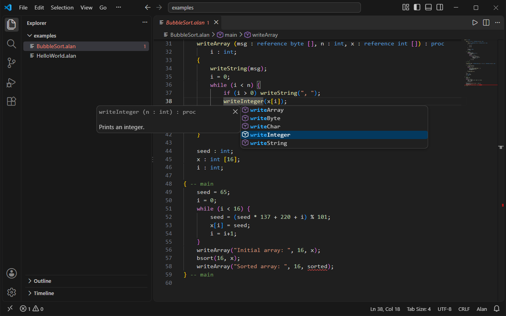
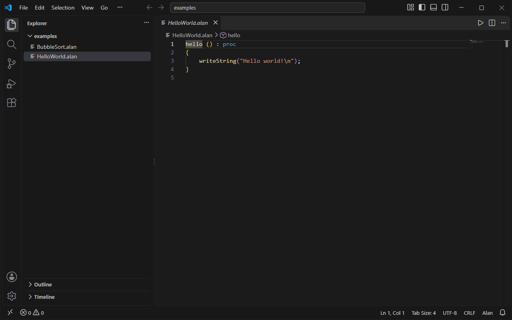

# Alan for Visual Studio Code

Write and run programs in Alan, the small Pascal-like teaching language, with the same comfort as a mainstream language. Open an `.alan` file to get colours, live errors, completion, formatting, rename and a debugger. One click installs the compiler, and one click runs your program.

## Features

- **Highlighting** for keywords, comments (`--` and nested `(* *)`), strings, characters, numbers and function names.
- **Live errors** while you type: syntax errors, undeclared names, duplicate names and wrong argument counts. They work even before a compiler is installed.
- **Compiler errors on save.** When a compiler is installed, `alanc check` also runs on save and adds its type errors to the Problems panel.
- **Completion** for keywords, the 14 library functions, and the functions, parameters and variables visible at the cursor. Snippets for a function, `if`, `if-else` and `while`.
- **Hover and signature help** that show declarations in Alan syntax, such as `swap (a : reference int, b : reference int) : proc`.
- **Go to definition, find all references, highlights and an outline** with nested functions.
- **Rename** of functions, parameters and variables. It refuses keywords, library names and names that would clash.
- **Formatting** of a document or a selection. It does nothing while the file has syntax errors.
- **One-click Run.** The play button in the editor title saves the file, compiles it and runs the program in a terminal, where it can also read input.
- **Debugging.** Press F5 in an `.alan` file to stop at breakpoints, step through the code and see Alan variables. No `launch.json` is needed.

## Install the compiler

The extension needs the Alan compiler `alanc` to run, build and debug programs. The editor features work without it.

- **From VS Code.** When you open an `.alan` file and no compiler is found, a notification offers to install it. You can also run **Alan: Install or Update Compiler** from the Command Palette. It downloads the latest release for your system from GitHub, checks it against the release's `SHA256SUMS` and keeps it in the extension's own storage. It needs no admin rights and nothing else, because the bundle carries its own linker.
- **From a terminal.** Use the one-line installers from the [compiler's README](https://github.com/sleousis/alan-compiler#install). The extension finds `alanc` on your PATH.
- **Your own build.** Set `alan.compilerPath` to its path.

The extension looks for the compiler in this order: `alan.compilerPath`, the copy it installed, then `alanc` on PATH. It asks each compiler for its version with `alanc --version` and offers an update when the compiler is older than v2.0.0.

Bundles exist for Windows, Linux and macOS 12 or later, each on x64 and ARM64. On Windows you can also run the compiler inside WSL. Turn on `alan.useWsl` and run **Alan: Install or Update Compiler**, and the Linux bundle is installed in your default WSL distribution.

Debugging uses the [CodeLLDB](https://marketplace.visualstudio.com/items?itemName=vadimcn.vscode-lldb) extension, which VS Code installs together with this one. On an ARM64 Mac or Windows PC, use the native ARM64 build of VS Code. The x64 build installs the ARM64 compiler to match the machine, but its x64 CodeLLDB cannot debug ARM64 programs.

## Commands

| Command | What it does |
| --- | --- |
| Alan: Run | Saves the file, compiles it and runs the program in a terminal. Also the play button in the editor title. |
| Alan: Build | Saves the file and writes an executable next to it. |
| Alan: Show IR | Shows the LLVM IR the compiler makes for the file, in an editor beside it. |
| Alan: Install or Update Compiler | Downloads the latest compiler release for your system. |
| Alan: Remove Installed Compiler | Deletes the compiler the extension installed. |

Compile errors from Run and Build show in the Problems panel.

## Settings

| Setting | Default | Meaning |
| --- | --- | --- |
| `alan.compilerPath` | empty | Path to `alanc`. Empty means the installed copy or `alanc` on PATH. |
| `alan.optimize` | `true` | Pass `-O` to the compiler for Run, Build and Show IR. Debug builds are never optimized. |
| `alan.useWsl` | `false` | On Windows, install and run the compiler inside WSL. |
| `alan.checkOnSave` | `true` | Run `alanc check` when a file is saved. |

The extension is the default formatter for Alan files. Turn on `editor.formatOnSave` to format on every save.

## Links

- [Source code, issues and compiler releases](https://github.com/sleousis/alan-compiler)
- [The Alan language specification](https://github.com/sleousis/alan-compiler/blob/master/alan2018.pdf)
